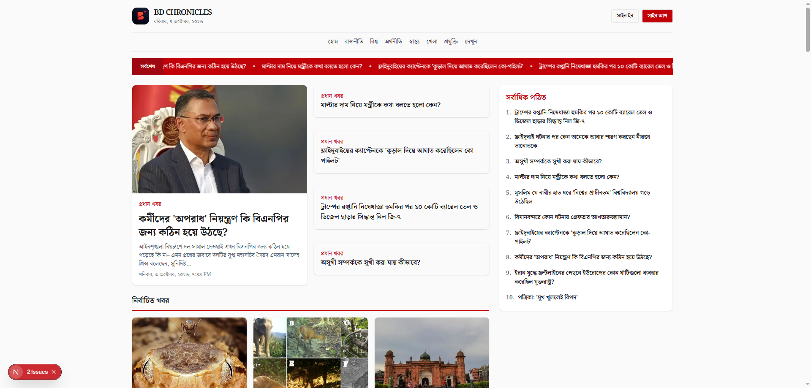
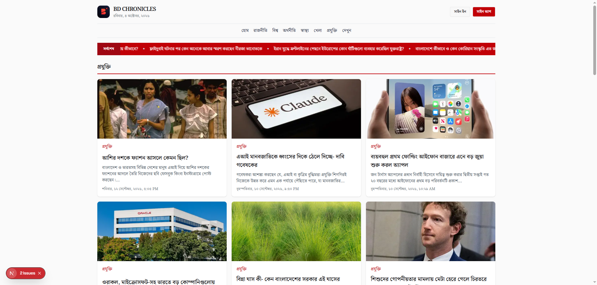

# BD-CHRONICLES

A modern Bengali news portal built with **Next.js**

## Features

* Browse the latest news
* View news by category
* Most-read news section
* Detailed article pages


## Tech Stack

* **Next.js** 
* **Tailwind CSS** 
* **DaisyUI** 

## API

Bangla Bulletin uses the [News API V2](https://news-api-v2.vercel.app/api) to fetch news, categories, and articles.

### Endpoints

| Endpoint | Description |
|---|---|
| `/api/categories` | Categories from the site navigation |
| `/api/news` | Latest headlines, flattened and deduplicated. Supports `limit`, `offset`, `category`, and `q` |
| `/api/news/sections` | Homepage news grouped into sections |
| `/api/news/most-read` | Ranked most-read articles |
| `/api/category/{categoryName}` | News from a specific category |
| `/api/article/{id}` | Full article with body, byline, topics, tags, and word count |

### API Base URL

https://news-api-v2.vercel.app/api/


## Getting Started

Clone the repository:

```bash
git clone https://github.com/rakibur-rafi/bd-chronicles.git
```

Go to the project directory:

```bash
cd bd-chronicles
```

Install dependencies:

```bash
npm install
```

Run the development server:

```bash
npm run dev
```

Open:

```text
http://localhost:3000
```

## Links

Live Website: [Vercel](https://bangla-bulletin.vercel.app/)

Github: [Github](https://github.com/rakibur-rafi/bd-chronicles)

## Screenshots








